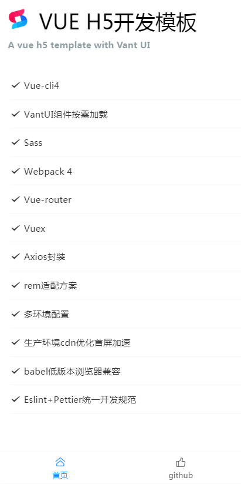

# vue-h5-template

基于 vue-cli4.0 + webpack 4 + vant ui + sass+ rem 适配方案+axios 封装，构建手机端模板脚手架

掘金: [vue-cli4 vant rem 移动端框架方案](https://juejin.im/post/5cfefc73f265da1bba58f9f7)

[查看 demo](https://solui.cn/vue-h5-template/#/) 建议手机端查看

<p>
  
</p>

### Node 版本要求

`Vue CLI` 需要 Node.js 8.9 或更高版本 (推荐 8.11.0+)。你可以使用 [nvm](https://github.com/nvm-sh/nvm) 或
[nvm-windows](https://github.com/coreybutler/nvm-windows) 在同一台电脑中管理多个 Node 版本。

本示例 Node.js 12.14.1

### 启动项目

```bash

git clone https://github.com/sunniejs/vue-h5-template.git

cd vue-h5-template

npm install

npm run serve
```

<span id="top">目录</span>

- √ Vue-cli4
- [√ 配置多环境变量](#env)
- [√ rem 适配方案](#rem)
- [√ vm 适配方案](#vm)
- [√ VantUI 组件按需加载](#vant)
- [√ Sass 全局样式](#sass)
- [√ Vuex 状态管理](#vuex)
- [√ Vue-router](#router)
- [√ Axios 封装及接口管理](#axios)
- [√ Webpack 4 vue.config.js 基础配置](#base)
- [√ 配置 alias 别名](#alias)
- [√ 配置 proxy 跨域](#proxy)
- [√ 配置 打包分析](#bundle)
- [√ 配置 externals 引入 cdn 资源 ](#externals)
- [√ 去掉 console.log ](#console)
- [√ splitChunks 单独打包第三方模块](#chunks)
- [√ 添加 IE 兼容 ](#ie)
- [√ Eslint+Pettier 统一开发规范 ](#pettier)

### <span id="env">✅ 配置多环境变量 </span>

`package.json` 里的 `scripts` 配置 `serve` `stage` `build`，通过 `--mode xxx` 来执行不同环境

- 通过 `npm run serve` 启动本地 , 执行 `development`
- 通过 `npm run stage` 打包测试 , 执行 `staging`
- 通过 `npm run build` 打包正式 , 执行 `production`

```javascript
"scripts": {
  "serve": "vue-cli-service serve --open",
  "stage": "vue-cli-service build --mode staging",
  "build": "vue-cli-service build",
}
```

##### 配置介绍

&emsp;&emsp;以 `VUE_APP_` 开头的变量，在代码中可以通过 `process.env.VUE_APP_` 访问。  
&emsp;&emsp;比如,`VUE_APP_ENV = 'development'` 通过`process.env.VUE_APP_ENV` 访问。  
&emsp;&emsp;除了 `VUE_APP_*` 变量之外，在你的应用代码中始终可用的还有两个特殊的变量`NODE_ENV` 和`BASE_URL`

在项目根目录中新建`.env.*`

- .env.development 本地开发环境配置

```bash
NODE_ENV='development'
# must start with VUE_APP_
VUE_APP_ENV = 'development'

```

- .env.staging 测试环境配置

```bash
NODE_ENV='production'
# must start with VUE_APP_
VUE_APP_ENV = 'staging'
```

- .env.production 正式环境配置

```bash
 NODE_ENV='production'
# must start with VUE_APP_
VUE_APP_ENV = 'production'
```

这里我们并没有定义很多变量，只定义了基础的 VUE_APP_ENV `development` `staging` `production`  
变量我们统一在 `src/config/env.*.js` 里进行管理。

这里有个问题，既然这里有了根据不同环境设置变量的文件，为什么还要去 config 下新建三个对应的文件呢？  
**修改起来方便，不需要重启项目，符合开发习惯。**

config/index.js

```javascript
// 根据环境引入不同配置 process.env.NODE_ENV
const config = require('./env.' + process.env.VUE_APP_ENV)
module.exports = config
```

配置对应环境的变量，拿本地环境文件 `env.development.js` 举例，用户可以根据需求修改

```javascript
// 本地环境配置
module.exports = {
  title: 'vue-h5-template',
  baseUrl: 'http://localhost:9018', // 项目地址
  baseApi: 'https://test.xxx.com/api', // 本地api请求地址
  APPID: 'xxx',
  APPSECRET: 'xxx'
}
```

根据环境不同，变量就会不同了

```javascript
// 根据环境不同引入不同baseApi地址
import { baseApi } from '@/config'
console.log(baseApi)
```

[▲ 回顶部](#top)

### <span id="rem">✅ rem 适配方案 </span>

不用担心，项目已经配置好了 `rem` 适配, 下面仅做介绍：

Vant 中的样式默认使用`px`作为单位，如果需要使用`rem`单位，推荐使用以下两个工具:

- [postcss-pxtorem](https://github.com/cuth/postcss-pxtorem) 是一款 `postcss` 插件，用于将单位转化为 `rem`
- [lib-flexible](https://github.com/amfe/lib-flexible) 用于设置 `rem` 基准值

##### PostCSS 配置

下面提供了一份基本的 `postcss` 配置，可以在此配置的基础上根据项目需求进行修改

```javascript
// https://github.com/michael-ciniawsky/postcss-load-config
module.exports = {
  plugins: {
    autoprefixer: {
      overrideBrowserslist: ['Android 4.1', 'iOS 7.1', 'Chrome > 31', 'ff > 31', 'ie >= 8']
    },
    'postcss-pxtorem': {
      rootValue: 37.5,
      propList: ['*']
    }
  }
}
```

更多详细信息： [vant](https://youzan.github.io/vant/#/zh-CN/quickstart#jin-jie-yong-fa)

**新手必看，老鸟跳过**

很多小伙伴会问我，适配的问题,因为我们使用的是 Vant UI，所以必须根据 Vant UI 375 的设计规范走，一般我们的设计会将 UI 图上
传到蓝湖，我们就可以需要的尺寸了。下面就大搞普及一下 rem。

我们知道 `1rem` 等于`html` 根元素设定的 `font-size` 的 `px` 值。Vant UI 设置 `rootValue: 37.5`,你可以看到在 iPhone 6 下
看到 （`1rem 等于 37.5px`）：

```html
<html data-dpr="1" style="font-size: 37.5px;"></html>
```

切换不同的机型，根元素可能会有不同的`font-size`。当你写 css px 样式时，会被程序换算成 `rem` 达到适配。

因为我们用了 Vant 的组件，需要按照 `rootValue: 37.5` 来写样式。

举个例子：设计给了你一张 750px \* 1334px 图片，在 iPhone6 上铺满屏幕,其他机型适配。

- 当`rootValue: 75` , 样式 `width: 750px;height: 1334px;` 图片会撑满 iPhone6 屏幕，这个时候切换其他机型，图片也会跟着撑
  满。
- 当`rootValue: 37.5` 的时候，样式 `width: 375px;height: 667px;` 图片会撑满 iPhone6 屏幕。

也就是 iphone 6 下 375px 宽度写 CSS。其他的你就可以根据你设计图，去写对应的样式就可以了。

当然，想要撑满屏幕你可以使用 100%，这里只是举例说明。

```html


<style>
  /* rootValue: 75 */
  .image {
    width: 750px;
    height: 1334px;
  }
  /* rootValue: 37.5 */
  .image {
    width: 375px;
    height: 667px;
  }
</style>
```

[▲ 回顶部](#top)

### <span id="vw">✅ vm 适配方案 </span>

本项目使用的是 rem 的 适配方案，其实无论你使用哪种方案，都不需要你去计算 12px 是多少 rem 或者 vw, 会有专门的工具去帮你做
。如果你想用 vw，你可以按照下面的方式切换。

#### 1.安装依赖

```bash

npm install postcss-px-to-viewport -D

```

#### 2.修改 .postcssrc.js

将根目录下 .postcssrc.js 文件修改如下

```javascript
// https://github.com/michael-ciniawsky/postcss-load-config
module.exports = {
  plugins: {
    autoprefixer: {
      overrideBrowserslist: ['Android 4.1', 'iOS 7.1', 'Chrome > 31', 'ff > 31', 'ie >= 8']
    },
    'postcss-px-to-viewport': {
      viewportWidth: 375, // 视窗的宽度，对应的是我们设计稿的宽度，一般是750
      unitPrecision: 3, // 指定`px`转换为视窗单位值的小数位数（很多时候无法整除）
      viewportUnit: 'vw', // 指定需要转换成的视窗单位，建议使用vw
      selectorBlackList: ['.ignore', '.hairlines'], // 指定不转换为视窗单位的类，可以自定义，可以无限添加,建议定义一至两个通用的类名
      minPixelValue: 1, // 小于或等于`1px`不转换为视窗单位，你也可以设置为你想要的值
      mediaQuery: false // 允许在媒体查询中转换`px`
    }
  }
}
```

#### 3.删除原来的 rem 相关代码

src/main.js 删除如下代码

```javascript
// 移动端适配
import 'lib-flexible/flexible.js'
```

package.json 删除如下代码

```javascript
"lib-flexible": "^0.3.2",
"postcss-pxtorem": "^5.1.1",
```

运行起来，F12 元素 css 就是 vw 单位了

[▲ 回顶部](#top)

### <span id="vant">✅ VantUI 组件按需加载 </span>

项目采
用[Vant 自动按需引入组件 (推荐)](https://youzan.github.io/vant/#/zh-CN/quickstart#fang-shi-yi.-zi-dong-an-xu-yin-ru-zu-jian-tui-jian)下
面安装插件介绍：

[babel-plugin-import](https://github.com/ant-design/babel-plugin-import) 是一款 `babel` 插件，它会在编译过程中将
`import` 的写法自动转换为按需引入的方式

#### 安装插件

```bash
npm i babel-plugin-import -D
```

在`babel.config.js` 设置

```javascript
// 对于使用 babel7 的用户，可以在 babel.config.js 中配置
const plugins = [
  [
    'import',
    {
      libraryName: 'vant',
      libraryDirectory: 'es',
      style: true
    },
    'vant'
  ]
]
module.exports = {
  presets: [['@vue/cli-plugin-babel/preset', { useBuiltIns: 'usage', corejs: 3 }]],
  plugins
}
```

#### 使用组件

项目在 `src/plugins/vant.js` 下统一管理组件，用哪个引入哪个，无需在页面里重复引用

```javascript
// 按需全局引入 vant组件
import Vue from 'vue'
import { Button, List, Cell, Tabbar, TabbarItem } from 'vant'
Vue.use(Button)
Vue.use(Cell)
Vue.use(List)
Vue.use(Tabbar).use(TabbarItem)
```

[▲ 回顶部](#top)

### <span id="sass">✅ Sass 全局样式</span>

首先 你可能会遇到 `node-sass` 安装不成功，别放弃多试几次！！！

每个页面自己对应的样式都写在自己的 .vue 文件之中 `scoped` 它顾名思义给 css 加了一个域的概念。

```html
<style lang="scss">
  /* global styles */
</style>

<style lang="scss" scoped>
  /* local styles */
</style>
```

#### 目录结构

vue-h5-template 所有全局样式都在 `@/src/assets/css` 目录下设置

```bash
├── assets
│   ├── css
│   │   ├── index.scss               # 全局通用样式
│   │   ├── mixin.scss               # 全局mixin
│   │   └── variables.scss           # 全局变量
```

#### 自定义 vant-ui 样式

现在我们来说说怎么重写 `vant-ui` 样式。由于 `vant-ui` 的样式我们是在全局引入的，所以你想在某个页面里面覆盖它的样式就不能
加 `scoped`，但你又想只覆盖这个页面的 `vant` 样式，你就可在它的父级加一个 `class`，用命名空间来解决问题。

```css
.about-container {
  /* 你的命名空间 */
  .van-button {
    /* vant-ui 元素*/
    margin-right: 0px;
  }
}
```

#### 父组件改变子组件样式 深度选择器

当你子组件使用了 `scoped` 但在父组件又想修改子组件的样式可以 通过 `>>>` 来实现：

```css
<style scoped>
.a >>> .b { /* ... */ }
</style>
```

#### 全局变量

`vue.config.js` 配置使用 `css.loaderOptions` 选项,注入 `sass` 的 `mixin` `variables` 到全局，不需要手动引入 ,配
置`$cdn`通过变量形式引入 cdn 地址,这样向所有 Sass/Less 样式传入共享的全局变量：

```javascript
const IS_PROD = ['production', 'prod'].includes(process.env.NODE_ENV)
const defaultSettings = require('./src/config/index.js')
module.exports = {
  css: {
    extract: IS_PROD,
    sourceMap: false,
    loaderOptions: {
      // 给 scss-loader 传递选项
      scss: {
        // 注入 `sass` 的 `mixin` `variables` 到全局, $cdn可以配置图片cdn
        // 详情: https://cli.vuejs.org/guide/css.html#passing-options-to-pre-processor-loaders
        prependData: `
                @import "assets/css/mixin.scss";
                @import "assets/css/variables.scss";
                $cdn: "${defaultSettings.$cdn}";
                 `
      }
    }
  }
}
```

设置 js 中可以访问 `$cdn`,`.vue` 文件中使用`this.$cdn`访问

```javascript
// 引入全局样式
import '@/assets/css/index.scss'

// 设置 js中可以访问 $cdn
// 引入cdn
import { $cdn } from '@/config'
Vue.prototype.$cdn = $cdn
```

在 css 和 js 使用

```html
<script>
  console.log(this.$cdn)
</script>
<style lang="scss" scoped>
  .logo {
    width: 120px;
    height: 120px;
    background: url($cdn + '/weapp/logo.png') center / contain no-repeat;
  }
</style>
```

[▲ 回顶部](#top)

### <span id="vuex">✅ Vuex 状态管理</span>

目录结构

```bash
├── store
│   ├── modules
│   │   └── app.js
│   ├── index.js
│   ├── getters.js
```

`main.js` 引入

```javascript
import Vue from 'vue'
import App from './App.vue'
import store from './store'
new Vue({
  el: '#app',
  router,
  store,
  render: h => h(App)
})
```

使用

```html
<script>
  import { mapGetters } from 'vuex'
  export default {
    computed: {
      ...mapGetters(['userName'])
    },

    methods: {
      // Action 通过 store.dispatch 方法触发
      doDispatch() {
        this.$store.dispatch('setUserName', '真乖，赶紧关注公众号，组织都在等你~')
      }
    }
  }
</script>
```

[▲ 回顶部](#top)

### <span id="router">✅ Vue-router </span>

本案例采用 `hash` 模式，开发者根据需求修改 `mode` `base`

**注意**：如果你使用了 `history` 模式，`vue.config.js` 中的 `publicPath` 要做对应的**修改**

前往:[vue.config.js 基础配置](#base)

```javascript
import Vue from 'vue'
import Router from 'vue-router'

Vue.use(Router)
export const router = [
  {
    path: '/',
    name: 'index',
    component: () => import('@/views/home/index'), // 路由懒加载
    meta: {
      title: '首页', // 页面标题
      keepAlive: false // keep-alive 标识
    }
  }
]
const createRouter = () =>
  new Router({
    // mode: 'history', // 如果你是 history模式 需要配置 vue.config.js publicPath
    // base: '/app/',
    scrollBehavior: () => ({ y: 0 }),
    routes: router
  })

export default createRouter()
```

更多:[Vue Router](https://router.vuejs.org/zh/)

[▲ 回顶部](#top)

### <span id="axios">✅ Axios 封装及接口管理</span>

`utils/request.js` 封装 axios ,开发者需要根据后台接口做修改。

- `service.interceptors.request.use` 里可以设置请求头，比如设置 `token`
- `config.hideloading` 是在 api 文件夹下的接口参数里设置，下文会讲
- `service.interceptors.response.use` 里可以对接口返回数据处理，比如 401 删除本地信息，重新登录

```javascript
import axios from 'axios'
import store from '@/store'
import { Toast } from 'vant'
// 根据环境不同引入不同api地址
import { baseApi } from '@/config'
// create an axios instance
const service = axios.create({
  baseURL: baseApi, // url = base api url + request url
  withCredentials: true, // send cookies when cross-domain requests
  timeout: 5000 // request timeout
})

// request 拦截器 request interceptor
service.interceptors.request.use(
  config => {
    // 不传递默认开启loading
    if (!config.hideloading) {
      // loading
      Toast.loading({
        forbidClick: true
      })
    }
    if (store.getters.token) {
      config.headers['X-Token'] = ''
    }
    return config
  },
  error => {
    // do something with request error
    console.log(error) // for debug
    return Promise.reject(error)
  }
)
// respone拦截器
service.interceptors.response.use(
  response => {
    Toast.clear()
    const res = response.data
    if (res.status && res.status !== 200) {
      // 登录超时,重新登录
      if (res.status === 401) {
        store.dispatch('FedLogOut').then(() => {
          location.reload()
        })
      }
      return Promise.reject(res || 'error')
    } else {
      return Promise.resolve(res)
    }
  },
  error => {
    Toast.clear()
    console.log('err' + error) // for debug
    return Promise.reject(error)
  }
)
export default service
```

#### 接口管理

在`src/api` 文件夹下统一管理接口

- 你可以建立多个模块对接接口, 比如 `home.js` 里是首页的接口这里讲解 `user.js`
- `url` 接口地址，请求的时候会拼接上 `config` 下的 `baseApi`
- `method` 请求方法
- `data` 请求参数 `qs.stringify(params)` 是对数据系列化操作
- `hideloading` 默认 `false`,设置为 `true` 后，不显示 loading ui 交互中有些接口不需要让用户感知

```javascript
import qs from 'qs'
// axios
import request from '@/utils/request'
//user api

// 用户信息
export function getUserInfo(params) {
  return request({
    url: '/user/userinfo',
    method: 'post',
    data: qs.stringify(params),
    hideloading: true // 隐藏 loading 组件
  })
}
```

#### 如何调用

```javascript
// 请求接口
import { getUserInfo } from '@/api/user.js'

const params = { user: 'sunnie' }
getUserInfo(params)
  .then(() => {})
  .catch(() => {})
```

[▲ 回顶部](#top)

### <span id="base">✅ Webpack 4 vue.config.js 基础配置 </span>

如果你的 `Vue Router` 模式是 hash

```javascript
publicPath: './',
```

如果你的 `Vue Router` 模式是 history 这里的 publicPath 和你的 `Vue Router` `base` **保持一直**

```javascript
publicPath: '/app/',
```

```javascript
const IS_PROD = ['production', 'prod'].includes(process.env.NODE_ENV)

module.exports = {
  publicPath: './', // 署应用包时的基本 URL。 vue-router hash 模式使用
  //  publicPath: '/app/', // 署应用包时的基本 URL。  vue-router history模式使用
  outputDir: 'dist', //  生产环境构建文件的目录
  assetsDir: 'static', //  outputDir的静态资源(js、css、img、fonts)目录
  lintOnSave: !IS_PROD,
  productionSourceMap: false, // 如果你不需要生产环境的 source map，可以将其设置为 false 以加速生产环境构建。
  devServer: {
    port: 9020, // 端口号
    open: false, // 启动后打开浏览器
    overlay: {
      //  当出现编译器错误或警告时，在浏览器中显示全屏覆盖层
      warnings: false,
      errors: true
    }
    // ...
  }
}
```

[▲ 回顶部](#top)

### <span id="alias">✅ 配置 alias 别名 </span>

```javascript
const path = require('path')
const resolve = dir => path.join(__dirname, dir)
const IS_PROD = ['production', 'prod'].includes(process.env.NODE_ENV)

module.exports = {
  chainWebpack: config => {
    // 添加别名
    config.resolve.alias
      .set('@', resolve('src'))
      .set('assets', resolve('src/assets'))
      .set('api', resolve('src/api'))
      .set('views', resolve('src/views'))
      .set('components', resolve('src/components'))
  }
}
```

[▲ 回顶部](#top)

### <span id="proxy">✅ 配置 proxy 跨域 </span>

如果你的项目需要跨域设置，你需要打来 `vue.config.js` `proxy` 注释 并且配置相应参数

<u>**!!!注意：你还需要将 `src/config/env.development.js` 里的 `baseApi` 设置成 '/'**</u>

```javascript
module.exports = {
  devServer: {
    // ....
    proxy: {
      //配置跨域
      '/api': {
        target: 'https://test.xxx.com', // 接口的域名
        // ws: true, // 是否启用websockets
        changOrigin: true, // 开启代理，在本地创建一个虚拟服务端
        pathRewrite: {
          '^/api': '/'
        }
      }
    }
  }
}
```

使用 例如: `src/api/home.js`

```javascript
export function getUserInfo(params) {
  return request({
    url: '/api/userinfo',
    method: 'post',
    data: qs.stringify(params)
  })
}
```

[▲ 回顶部](#top)

### <span id="bundle">✅ 配置 打包分析 </span>

```javascript
const BundleAnalyzerPlugin = require('webpack-bundle-analyzer').BundleAnalyzerPlugin

module.exports = {
  chainWebpack: config => {
    // 打包分析
    if (IS_PROD) {
      config.plugin('webpack-report').use(BundleAnalyzerPlugin, [
        {
          analyzerMode: 'static'
        }
      ])
    }
  }
}
```

```bash
npm run build
```

[▲ 回顶部](#top)

### <span id="externals">✅ 配置 externals 引入 cdn 资源 </span>

这个版本 CDN 不再引入，我测试了一下使用引入 CDN 和不使用,不使用会比使用时间少。网上不少文章测试 CDN 速度块，这个开发者可
以实际测试一下。

另外项目中使用的是公共 CDN 不稳定，域名解析也是需要时间的（如果你要使用请尽量使用同一个域名）

因为页面每次遇到`<script>`标签都会停下来解析执行，所以应该尽可能减少`<script>`标签的数量 `HTTP`请求存在一定的开销，100K
的文件比 5 个 20K 的文件下载的更快，所以较少脚本数量也是很有必要的

暂时还没有研究放到自己的 cdn 服务器上。

```javascript
const defaultSettings = require('./src/config/index.js')
const name = defaultSettings.title || 'vue mobile template'
const IS_PROD = ['production', 'prod'].includes(process.env.NODE_ENV)

// externals
const externals = {
  vue: 'Vue',
  'vue-router': 'VueRouter',
  vuex: 'Vuex',
  vant: 'vant',
  axios: 'axios'
}
// CDN外链，会插入到index.html中
const cdn = {
  // 开发环境
  dev: {
    css: [],
    js: []
  },
  // 生产环境
  build: {
    css: ['https://cdn.jsdelivr.net/npm/vant@2.4.7/lib/index.css'],
    js: [
      'https://cdn.jsdelivr.net/npm/vue@2.6.11/dist/vue.min.js',
      'https://cdn.jsdelivr.net/npm/vue-router@3.1.5/dist/vue-router.min.js',
      'https://cdn.jsdelivr.net/npm/axios@0.19.2/dist/axios.min.js',
      'https://cdn.jsdelivr.net/npm/vuex@3.1.2/dist/vuex.min.js',
      'https://cdn.jsdelivr.net/npm/vant@2.4.7/lib/index.min.js'
    ]
  }
}
module.exports = {
  configureWebpack: config => {
    config.name = name
    // 为生产环境修改配置...
    if (IS_PROD) {
      // externals
      config.externals = externals
    }
  },
  chainWebpack: config => {
    /**
     * 添加CDN参数到htmlWebpackPlugin配置中
     */
    config.plugin('html').tap(args => {
      if (IS_PROD) {
        args[0].cdn = cdn.build
      } else {
        args[0].cdn = cdn.dev
      }
      return args
    })
  }
}
```

在 public/index.html 中添加

```javascript
    <!-- 使用CDN的CSS文件 -->
    <% for (var i in
      htmlWebpackPlugin.options.cdn&&htmlWebpackPlugin.options.cdn.css) { %>
      <link href="<%= htmlWebpackPlugin.options.cdn.css[i] %>" rel="preload" as="style" />
      <link href="<%= htmlWebpackPlugin.options.cdn.css[i] %>" rel="stylesheet" />
    <% } %>
     <!-- 使用CDN加速的JS文件，配置在vue.config.js下 -->
    <% for (var i in
      htmlWebpackPlugin.options.cdn&&htmlWebpackPlugin.options.cdn.js) { %>
      <script src="<%= htmlWebpackPlugin.options.cdn.js[i] %>"></script>
    <% } %>
```

[▲ 回顶部](#top)

### <span id="console">✅ 去掉 console.log </span>

保留了测试环境和本地环境的 `console.log`

```bash
npm i -D babel-plugin-transform-remove-console
```

在 babel.config.js 中配置

```javascript
// 获取 VUE_APP_ENV 非 NODE_ENV，测试环境依然 console
const IS_PROD = ['production', 'prod'].includes(process.env.VUE_APP_ENV)
const plugins = [
  [
    'import',
    {
      libraryName: 'vant',
      libraryDirectory: 'es',
      style: true
    },
    'vant'
  ]
]
// 去除 console.log
if (IS_PROD) {
  plugins.push('transform-remove-console')
}

module.exports = {
  presets: [['@vue/cli-plugin-babel/preset', { useBuiltIns: 'entry' }]],
  plugins
}
```

[▲ 回顶部](#top)

### <span id="chunks">✅ splitChunks 单独打包第三方模块</span>

```javascript
module.exports = {
  chainWebpack: config => {
    config.when(IS_PROD, config => {
      config
        .plugin('ScriptExtHtmlWebpackPlugin')
        .after('html')
        .use('script-ext-html-webpack-plugin', [
          {
            // 将 runtime 作为内联引入不单独存在
            inline: /runtime\..*\.js$/
          }
        ])
        .end()
      config.optimization.splitChunks({
        chunks: 'all',
        cacheGroups: {
          // cacheGroups 下可以可以配置多个组，每个组根据test设置条件，符合test条件的模块
          commons: {
            name: 'chunk-commons',
            test: resolve('src/components'),
            minChunks: 3, //  被至少用三次以上打包分离
            priority: 5, // 优先级
            reuseExistingChunk: true // 表示是否使用已有的 chunk，如果为 true 则表示如果当前的 chunk 包含的模块已经被抽取出去了，那么将不会重新生成新的。
          },
          node_vendors: {
            name: 'chunk-libs',
            chunks: 'initial', // 只打包初始时依赖的第三方
            test: /[\\/]node_modules[\\/]/,
            priority: 10
          },
          vantUI: {
            name: 'chunk-vantUI', // 单独将 vantUI 拆包
            priority: 20, // 数字大权重到，满足多个 cacheGroups 的条件时候分到权重高的
            test: /[\\/]node_modules[\\/]_?vant(.*)/
          }
        }
      })
      config.optimization.runtimeChunk('single')
    })
  }
}
```

[▲ 回顶部](#top)

### <span id="ie">✅ 添加 IE 兼容 </span>

之前的方式 会报 `@babel/polyfill` is deprecated. Please, use required parts of `core-js` and
`regenerator-runtime/runtime` separately

`@babel/polyfill` 废弃，使用 `core-js` 和 `regenerator-runtime`

```bash
npm i --save core-js regenerator-runtime
```

在 `main.js` 中添加

```javascript
// 兼容 IE
// https://github.com/zloirock/core-js/blob/master/docs/2019-03-19-core-js-3-babel-and-a-look-into-the-future.md#babelpolyfill
import 'core-js/stable'
import 'regenerator-runtime/runtime'
```

配置 `babel.config.js`

```javascript
const plugins = []

module.exports = {
  presets: [['@vue/cli-plugin-babel/preset', { useBuiltIns: 'usage', corejs: 3 }]],
  plugins
}
```

[▲ 回顶部](#top)

### <span id="pettier">✅ Eslint + Pettier 统一开发规范 </span>

VScode （版本 1.47.3）安装 `eslint` `prettier` `vetur` 插件 `.vue` 文件使用 vetur 进行格式化，其他使用`prettier`,后面会
专门写个如何使用配合使用这三个玩意

在文件 `.prettierrc` 里写 属于你的 pettier 规则

```bash
{
   "printWidth": 120,
   "tabWidth": 2,
   "singleQuote": true,
   "trailingComma": "none",
   "semi": false,
   "wrap_line_length": 120,
   "wrap_attributes": "auto",
   "proseWrap": "always",
   "arrowParens": "avoid",
   "bracketSpacing": false,
   "jsxBracketSameLine": true,
   "useTabs": false,
   "overrides": [{
       "files": ".prettierrc",
       "options": {
           "parser": "json"
       }
   }]
}
```

Vscode setting.json 设置

```bash
    {
  // 将设置放入此文件中以覆盖默认设置
  "files.autoSave": "off",
  // 控制字体系列。
  "editor.fontFamily": "Consolas, 'Courier New', monospace,'宋体'",
  "terminal.integrated.shell.windows": "C:\\Program Files\\Git\\bin\\bash.exe",
  // 以像素为单位控制字号。
  "editor.fontSize": 16,
  // 控制选取范围是否有圆角
  "editor.roundedSelection": false,
  // 建议小组件的字号
  "editor.suggestFontSize": 16,
  // 在“打开的编辑器”窗格中显示的编辑器数量。将其设置为 0 可隐藏窗格。
  "explorer.openEditors.visible": 0,
  // 是否已启用自动刷新
  "git.autorefresh": true,
  // 以像素为单位控制终端的字号，这是 editor.fontSize 的默认值。
  "terminal.integrated.fontSize": 14,
  // 控制终端游标是否闪烁。
  "terminal.integrated.cursorBlinking": true,
  // 一个制表符等于的空格数。该设置在 `editor.detectIndentation` 启用时根据文件内容进行重写。
  // Tab Size
  "editor.tabSize": 2,
  // By default, common template. Do not modify it!!!!!
  "editor.formatOnType": true,
  "window.zoomLevel": 0,
  "editor.detectIndentation": false,
  "css.fileExtensions": ["css", "scss"],
  "files.associations": {
    "*.string": "html",
    "*.vue": "vue",
    "*.wxss": "css",
    "*.wxml": "wxml",
    "*.wxs": "javascript",
    "*.cjson": "jsonc",
    "*.js": "javascript"
  },
  // 为指定的语法定义配置文件或使用带有特定规则的配置文件。
  "emmet.syntaxProfiles": {
    "vue-html": "html",
    "vue": "html"
  },
  "search.exclude": {
    "**/node_modules": true,
    "**/bower_components": true
  },
  //保存时eslint自动修复错误
  "editor.formatOnSave": true,
  // Enable per-language
  //配置 ESLint 检查的文件类型
  "editor.quickSuggestions": {
    "strings": true
  },
  // 添加 vue 支持
  // 这里是针对vue文件的格式化设置，vue的规则在这里生效
  "vetur.format.options.tabSize": 2,
  "vetur.format.options.useTabs": false,
  "vetur.format.defaultFormatter.html": "js-beautify-html",
  "vetur.format.defaultFormatter.css": "prettier",
  "vetur.format.defaultFormatter.scss": "prettier",
  "vetur.format.defaultFormatter.postcss": "prettier",
  "vetur.format.defaultFormatter.less": "prettier",
  "vetur.format.defaultFormatter.js": "vscode-typescript",
  "vetur.format.defaultFormatter.sass": "sass-formatter",
  "vetur.format.defaultFormatter.ts": "prettier",
  "vetur.format.defaultFormatterOptions": {
    "js-beautify-html": {
      "wrap_attributes": "aligned-multiple", // 超过150折行
      "wrap-line-length": 150
    },
    // #vue组件中html代码格式化样式
    "prettier": {
      "printWidth": 120,
      "tabWidth": 2,
      "singleQuote": false,
      "trailingComma": "none",
      "semi": false,
      "wrap_line_length": 120,
      "wrap_attributes": "aligned-multiple", // 超过150折行
      "proseWrap": "always",
      "arrowParens": "avoid",
      "bracketSpacing": true,
      "jsxBracketSameLine": true,
      "useTabs": false,
      "overrides": [
        {
          "files": ".prettierrc",
          "options": {
            "parser": "json"
          }
        }
      ]
    }
  },
  // Enable per-language
  "[json]": {
    "editor.defaultFormatter": "esbenp.prettier-vscode"
  },
  "vetur.validation.template": false,
  "html.format.enable": false,
  "json.format.enable": false,
  "javascript.format.enable": false,
  "typescript.format.enable": false,
  "javascript.format.insertSpaceAfterFunctionKeywordForAnonymousFunctions": false,
  "[html]": {
    "editor.defaultFormatter": "esbenp.prettier-vscode"
  },
  "[javascript]": {
    "editor.defaultFormatter": "esbenp.prettier-vscode"
  },
  "[jsonc]": {
    "editor.defaultFormatter": "esbenp.prettier-vscode"
  },
  "[vue]": {
    "editor.defaultFormatter": "octref.vetur"
  },
  "emmet.includeLanguages": {
    "wxml": "html"
  },
  "[typescriptreact]": {
    "editor.defaultFormatter": "esbenp.prettier-vscode"
  },
  // 开启eslint自动修复js/ts功能
  "editor.codeActionsOnSave": {
    "source.fixAll.eslint": true
  },
  "minapp-vscode.disableAutoConfig": true,
  "javascript.implicitProjectConfig.experimentalDecorators": true,
  "editor.maxTokenizationLineLength": 200000
}

```

[▲ 回顶部](#top)

# 鸣谢 ​

[vue-cli4-config](https://github.com/staven630/vue-cli4-config)  
[vue-element-admin](https://github.com/PanJiaChen/vue-element-admin)

# 关于我

获取更多技术相关文章，关注公众号”前端女塾“。

回复加群，即可加入”前端仙女群“

 <p>
  
</p>

扫描添加下方的微信并备注 Sol 加交流群，交流学习，及时获取代码最新动态。

<p>
  
</p>
 
如果对你有帮助送我一颗小星星（づ￣3￣）づ╭❤～
